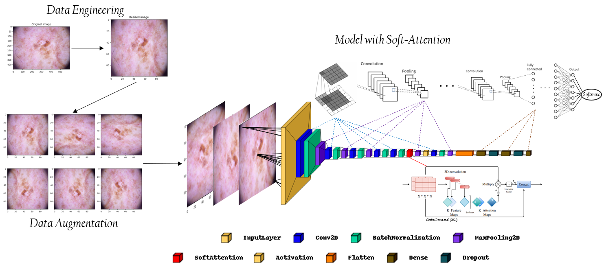
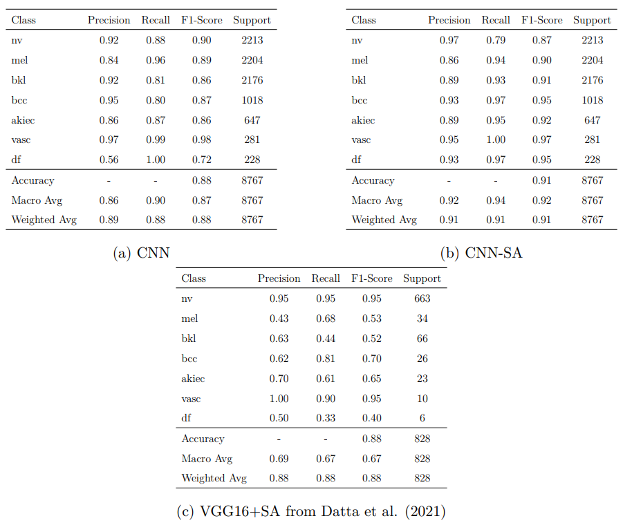
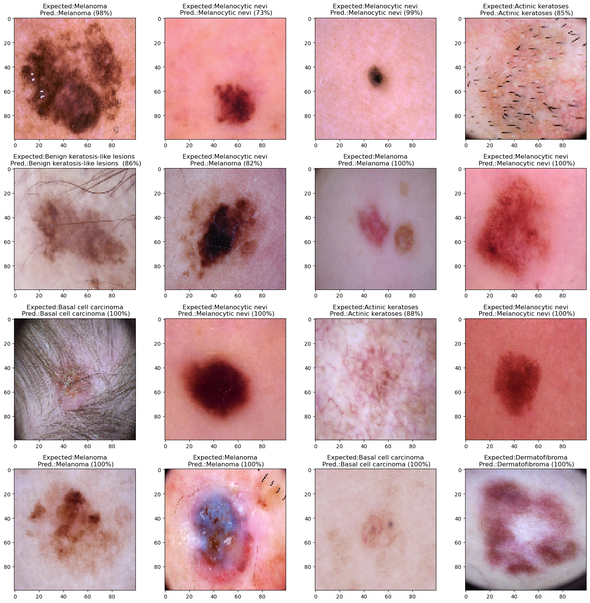

# Skin Cancer Classification
#  – Attention to The Detail –

Running the code is fairly easy: Just open the notebooks in Google Colaboratory or Kaggle, 
load $kaggle.json$ containing your Kaggle API-key into the runtime, and let the notebooks run.
Also, make sure to turn on the provided cloud-GPU when training the models.

The required libraries and packages will automatically be installed.

## Outputs:

## Visual Representation:

## Datasets:
Cite the data accordingly when using in a project:

- **HAM10000**

Tschandl, P., Rosendahl, C. & Kittler, H. The HAM10000 dataset, a large collection of multi-source dermatoscopic images of common pigmented skin lesions. Sci. Data 5, 180161 doi:10.1038/sdata.2018.161 (2018).

- **ISIC 2019 Challenge**
1. Tschandl P., Rosendahl C. & Kittler H. The HAM10000 dataset, a large collection of multi-source dermatoscopic images of common pigmented skin lesions. Sci. Data 5, 180161 doi.10.1038/sdata.2018.161 (2018)

2. Noel C. F. Codella, David Gutman, M. Emre Celebi, Brian Helba, Michael A. Marchetti, Stephen W. Dusza, Aadi Kalloo, Konstantinos Liopyris, Nabin Mishra, Harald Kittler, Allan Halpern: "Skin Lesion Analysis Toward Melanoma Detection: A Challenge at the 2017 International Symposium on Biomedical Imaging (ISBI), Hosted by the International Skin Imaging Collaboration (ISIC)", 2017; arXiv:1710.05006.

3. Marc Combalia, Noel C. F. Codella, Veronica Rotemberg, Brian Helba, Veronica Vilaplana, Ofer Reiter, Allan C. Halpern, Susana Puig, Josep Malvehy: "BCN20000: Dermoscopic Lesions in the Wild", 2019; arXiv:1908.02288.
